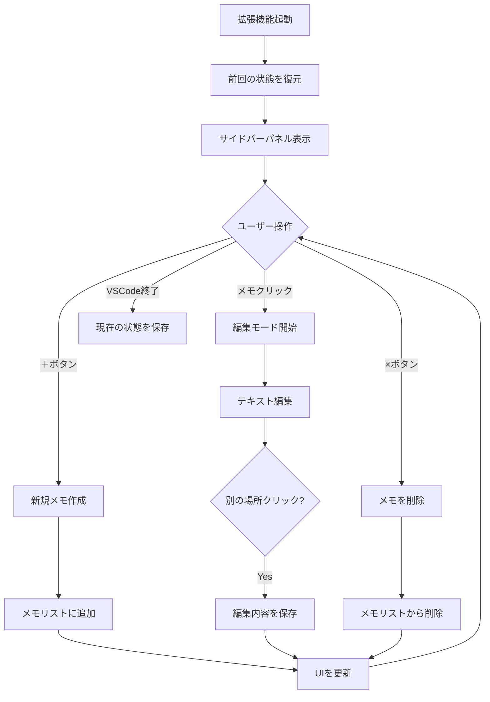
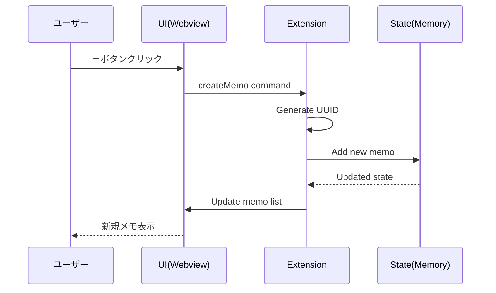

# Prompt Memo VSCode拡張機能 仕様書

## 1. 概要

### 1.1 目的
VSCode上で簡単に一時的なメモを作成・管理できる拡張機能を提供する。ユーザーは思いついたアイデアやコードスニペットを素早くメモし、作業に集中できる。

### 1.2 スコープ
- VSCodeのサイドバーに表示される専用パネルでメモを管理
- メモリ内でのデータ管理（永続化なし、ただしセッション中は保持）
- シンプルで直感的なUI操作

## 2. 機能要件

### 2.1 基本機能
| 機能 | 説明 |
|------|------|
| メモ作成 | ＋ボタンクリックで新規メモを作成 |
| メモ編集 | メモをクリックして直接編集 |
| メモ削除 | 各メモの×ボタンで即座に削除 |
| 自動保存 | 編集内容は自動的にメモリに保存 |
| セッション復元 | VSCode再起動時に最後の状態を復元 |

### 2.2 制約事項
- ファイルへの永続保存は行わない
- キーボードショートカットは提供しない
- 文字数制限なし
- 確認ダイアログなし

## 3. UI/UX設計

### 3.1 レイアウト
```
┌─────────────────────────┐
│ PROMPT MEMO        [+]  │ <- ヘッダー
├─────────────────────────┤
│ ┌─────────────────[×]─┐ │
│ │ メモを入力...       │ │ <- メモ1
│ └─────────────────────┘ │
│                         │
│ ┌─────────────────[×]─┐ │
│ │ メモ内容が長い場合  │ │
│ │ ボックスが自動的に  │ │ <- メモ2
│ │ 拡張される          │ │
│ └─────────────────────┘ │
│          ⋮              │
└─────────────────────────┘
```

### 3.2 UI仕様
- **配置**: VSCodeの左サイドバー（アクティビティバー）
- **アイコン**: メモ帳アイコン
- **テーマ**: VSCodeのテーマに追従（ダーク/ライト）
- **メモの高さ**: 
  - 最小: 1行分
  - 最大: 画面の半分まで自動拡張
- **スクロール**: メモ一覧が画面を超える場合はスクロールバー表示
- **並び順**: 作成順（新しいメモが下に追加）

### 3.3 インタラクション
1. **新規作成**: ＋ボタンクリック → 空のメモが最下部に追加
2. **編集開始**: メモ内をクリック → カーソル表示、即編集可能
3. **編集終了**: 他のメモをクリック or パネル外をクリック → 自動保存
4. **削除**: ×ボタンクリック → 即座に削除（確認なし）
5. **改行**: Enter/Shift+Enter → 改行挿入

## 4. 技術仕様

### 4.1 開発環境
- **言語**: TypeScript
- **フレームワーク**: VSCode Extension API
- **ビューレンダリング**: Webview API
- **スタイリング**: CSS（VSCodeテーマ変数使用）

### 4.2 データ管理
- **保存先**: ExtensionContext.workspaceState（メモリ内）
- **データ形式**:
```typescript
interface Memo {
  id: string;          // UUID
  content: string;     // メモ内容
  createdAt: number;   // タイムスタンプ
}

interface MemoState {
  memos: Memo[];
}
```

## 5. 処理フロー

### 5.1 全体フロー


### 5.2 メモ作成詳細フロー


## 6. 実装詳細

### 6.1 主要コンポーネント

#### Extension本体 (`extension.ts`)
```typescript
export function activate(context: vscode.ExtensionContext) {
    // プロバイダー登録
    const provider = new MemoViewProvider(context);
    
    // ビュー登録
    context.subscriptions.push(
        vscode.window.registerWebviewViewProvider(
            'promptMemo.memoView',
            provider
        )
    );
    
    // コマンド登録
    context.subscriptions.push(
        vscode.commands.registerCommand('promptMemo.createMemo', () => {
            provider.createMemo();
        })
    );
}
```

#### ViewProvider (`memoViewProvider.ts`)
```typescript
class MemoViewProvider implements vscode.WebviewViewProvider {
    private _view?: vscode.WebviewView;
    private memos: Memo[] = [];
    
    constructor(private readonly context: vscode.ExtensionContext) {
        // 前回の状態を復元
        this.memos = context.workspaceState.get('memos', []);
    }
    
    public resolveWebviewView(webviewView: vscode.WebviewView) {
        this._view = webviewView;
        
        // Webviewオプション設定
        webviewView.webview.options = {
            enableScripts: true
        };
        
        // HTML生成
        webviewView.webview.html = this.getHtmlContent();
        
        // メッセージハンドリング
        webviewView.webview.onDidReceiveMessage(message => {
            switch (message.command) {
                case 'updateMemo':
                    this.updateMemo(message.id, message.content);
                    break;
                case 'deleteMemo':
                    this.deleteMemo(message.id);
                    break;
            }
        });
    }
}
```

### 6.2 Webview HTML/CSS/JS

#### スタイル定義
```css
.memo-container {
    padding: 8px;
    margin: 8px;
    border: 1px solid var(--vscode-widget-border);
    border-radius: 4px;
    position: relative;
    min-height: 32px;
    max-height: 50vh;
    overflow-y: auto;
}

.memo-textarea {
    width: 100%;
    background: transparent;
    border: none;
    color: var(--vscode-editor-foreground);
    font-family: var(--vscode-font-family);
    resize: none;
    outline: none;
}

.delete-button {
    position: absolute;
    top: 4px;
    right: 4px;
    background: transparent;
    border: none;
    color: var(--vscode-icon-foreground);
    cursor: pointer;
}
```

## 7. ファイル構成

```
prompt-memo/
├── src/
│   ├── extension.ts          # エントリーポイント
│   ├── memoViewProvider.ts   # ビュープロバイダー
│   ├── types.ts              # 型定義
│   └── webview/
│       ├── index.html        # Webviewテンプレート
│       ├── style.css         # スタイル
│       └── script.js         # Webview側スクリプト
├── resources/
│   └── icon.svg              # メモ帳アイコン
├── package.json              # 拡張機能マニフェスト
├── tsconfig.json             # TypeScript設定
└── README.md                 # ドキュメント
```

## 8. package.json設定

```json
{
    "name": "prompt-memo",
    "displayName": "Prompt Memo",
    "description": "Simple temporary memo extension for VSCode",
    "version": "1.0.0",
    "engines": {
        "vscode": "^1.60.0"
    },
    "categories": ["Other"],
    "activationEvents": [
        "onView:promptMemo.memoView"
    ],
    "main": "./out/extension.js",
    "contributes": {
        "views": {
            "explorer": [
                {
                    "type": "webview",
                    "id": "promptMemo.memoView",
                    "name": "Prompt Memo",
                    "icon": "resources/icon.svg",
                    "contextualTitle": "Prompt Memo"
                }
            ]
        },
        "commands": [
            {
                "command": "promptMemo.createMemo",
                "title": "Create New Memo",
                "icon": "$(add)"
            }
        ],
        "menus": {
            "view/title": [
                {
                    "command": "promptMemo.createMemo",
                    "when": "view == promptMemo.memoView",
                    "group": "navigation"
                }
            ]
        }
    }
}
```

## 9. エラー処理とエッジケース

### 9.1 考慮すべきケース
- メモリ不足時の処理
- 大量のメモ作成時のパフォーマンス
- Webviewの再読み込み時の状態保持
- テーマ切り替え時の表示更新

### 9.2 制限事項
- ワークスペース間でのメモ共有は不可
- ファイルへのエクスポート機能なし
- 検索・フィルタリング機能なし

## 10. 今後の拡張可能性

- マークダウン対応
- タグ機能
- 検索機能
- エクスポート/インポート機能
- ワークスペース間での共有