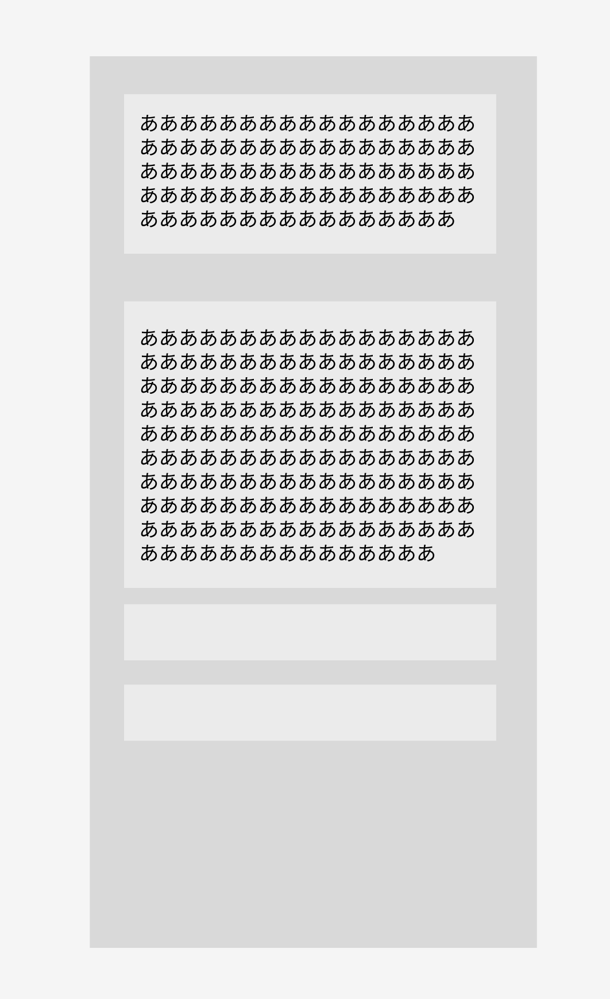

# Prompt Memo (VSCode Extension)

VSCode のサイドバーで、思いついたメモやスニペットを素早く記録・編集・削除できるシンプルなメモ拡張機能です。編集内容は自動保存され、VSCode を再起動してもセッション内の最後の状態が復元されます（ワークスペース内メモリ保存）。

- 仕様書: [Prompt Memo VSCode拡張機能 仕様書.md](Prompt%20Memo%20VSCode拡張機能%20仕様書.md)
- アイコン: [resources/icon.svg](resources/icon.svg)
- エントリポイント: [src/extension.ts](src/extension.ts)
- ビュープロバイダー: [src/memoViewProvider.ts](src/memoViewProvider.ts)
- Webview: [src/webview/index.html](src/webview/index.html), [src/webview/style.css](src/webview/style.css), [src/webview/script.js](src/webview/script.js)
- 型定義: [src/types.ts](src/types.ts)
- マニフェスト: [package.json](package.json)
- TypeScript 設定: [tsconfig.json](tsconfig.json)

## スクリーンショット（参考）


## 主な機能
- メモ作成: ビュータイトルの [+] ボタンで新規メモ（下に追加）
- メモ編集: クリックで即編集（フォーカス外れ時に自動保存）
- メモ削除: 各メモ右上の × ボタンで即削除（確認なし）
- 自動保存: テキスト変更は自動的にメモリへ保存
- セッション復元: VSCode 再起動時に最後の状態を復元
- テーマ追従: VSCode のダーク/ライトに準拠
- レイアウト: メモは自動的に高さ調整（最小 1 行、最大 画面高さの 50%）

## データ管理
- 保存先: `ExtensionContext.workspaceState`（ワークスペース単位のメモリ保存）
- 永続化: ファイルへの保存は行いません（仕様）

## UI/UX
- 配置: サイドバー（Explorer コンテナ内のビュー）
  - ビュー ID: `promptMemo.memoView`
  - ビュータイトルアクション（メニュー）で新規メモ作成
- スタイル: VSCode テーマ変数使用（色/フォント等）

## 導入（最短ワンコマンド）

- このフォルダを VS Code で開いた状態で実行
  ```
  npm run setup -- --devhost
  ```
  - 依存インストール → TypeScript コンパイル → Extension Development Host（別ウィンドウ）を自動起動
  - Explorer に「Prompt Memo」ビューが表示されます（見当たらない場合は「View: Open View」で「Prompt Memo」を検索）

## よく使うタスク

- 開発ホストの起動（F5 相当）
  ```
  npm start
  ```
- VSIX を作成
  ```
  npm run package
  ```
- VSIX を作成してインストールまで実行
  ```
  npm run package:install
  ```

## 使い方

- ビュータイトルの [+] で新規メモ
- メモをクリックして編集（フォーカス外れで自動保存）
- 右上の × ボタンで削除

## コマンド/メニュー
- コマンド: `promptMemo.createMemo`（タイトル: Create New Memo）
- ビュータイトルメニュー（`view/title`）: ビューが `promptMemo.memoView` のときに [+] を表示
- 貢献ポイントは [package.json](package.json) の `contributes.views` / `contributes.commands` / `contributes.menus` を参照

## ファイル構成
```
prompt-memo/
├── src/
│   ├── extension.ts          # エントリーポイント
│   ├── memoViewProvider.ts   # WebviewViewProvider + 状態管理 + メッセージ処理
│   ├── types.ts              # 型定義
│   └── webview/
│       ├── index.html        # Webview テンプレート（CSP/URI を差し込み）
│       ├── style.css         # スタイル（テーマ変数に準拠）
│       └── script.js         # Webview 側ロジック（描画/自動リサイズ/保存/削除）
├── resources/
│   └── icon.svg              # ビューアイコン
├── package.json              # 拡張機能マニフェスト
├── tsconfig.json             # TypeScript 設定
└── README.md                 # この文書
```

## 設計メモ
- Webview は `index.html` をベースに、`style.css`/`script.js` を CSP/nonce 付きで読み込み
- VSCode との通信は `window.postMessage` / `onDidReceiveMessage` で実装
- メモの高さは textarea の `input/focus` タイミングで自動調整（50vh 上限）

## 既知の制約
- ファイル永続化なし（仕様）
- キーボードショートカットなし（仕様）
- 検索/フィルタリングなし（将来拡張）
- ワークスペース間共有なし（将来拡張）
- 大量メモ時のパフォーマンスは Webview 仕様に依存

## ライセンス
MIT# VS_memo
