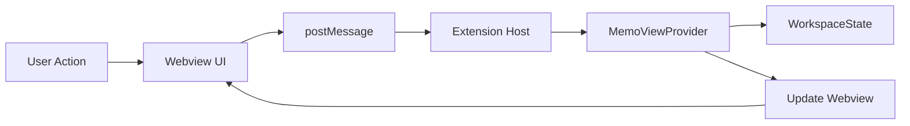

# Prompt Memo VSCode拡張機能 設計書

## 1. アーキテクチャ設計

### 1.1 全体構成
```
prompt-memo/
├── src/
│   ├── extension.ts          # エントリーポイント
│   ├── providers/
│   │   └── MemoViewProvider.ts   # Webviewプロバイダー
│   ├── models/
│   │   └── Memo.ts           # メモモデル
│   ├── types/
│   │   └── index.ts          # 型定義
│   ├── utils/
│   │   └── uuid.ts           # ユーティリティ関数
│   └── webview/
│       ├── webview.html      # Webviewテンプレート
│       ├── webview.css       # スタイル
│       └── webview.js        # クライアントサイドスクリプト
├── resources/
│   └── icon.svg              # 拡張機能アイコン
├── out/                      # コンパイル済みJS
├── package.json
├── tsconfig.json
├── .eslintrc.json
├── .gitignore
└── README.md
```

### 1.2 コンポーネント設計

#### Extension（エントリーポイント）
- **責務**: 拡張機能の初期化とライフサイクル管理
- **依存**: MemoViewProvider

#### MemoViewProvider
- **責務**: Webviewの管理とメモデータの永続化
- **依存**: VSCode Extension API, Memo model
- **提供機能**:
  - Webview HTMLの生成
  - メッセージハンドリング
  - 状態管理（workspaceState）

#### Memo Model
- **責務**: メモデータの構造定義
- **プロパティ**:
  - id: string (UUID)
  - content: string
  - createdAt: number
  - updatedAt: number

### 1.3 データフロー



## 2. 詳細設計

### 2.1 メッセージプロトコル

#### Webview → Extension
```typescript
interface WebviewMessage {
    command: 'createMemo' | 'updateMemo' | 'deleteMemo' | 'loadMemos';
    payload?: {
        id?: string;
        content?: string;
    };
}
```

#### Extension → Webview
```typescript
interface ExtensionMessage {
    command: 'setMemos' | 'memoCreated' | 'memoUpdated' | 'memoDeleted';
    payload: {
        memos?: Memo[];
        memo?: Memo;
        id?: string;
    };
}
```

### 2.2 状態管理

#### 永続化戦略
- **保存タイミング**: 
  - メモ作成時
  - メモ更新時（デバウンス: 500ms）
  - メモ削除時
  - 拡張機能終了時

#### データ構造
```typescript
interface StoredState {
    version: string;  // スキーマバージョン
    memos: Memo[];
    lastModified: number;
}
```

### 2.3 セキュリティ設計

#### Content Security Policy
```html
<meta http-equiv="Content-Security-Policy" 
      content="default-src 'none'; 
               script-src ${webview.cspSource} 'unsafe-inline'; 
               style-src ${webview.cspSource} 'unsafe-inline';">
```

#### リソースアクセス制限
```typescript
webviewOptions: {
    enableScripts: true,
    localResourceRoots: [
        vscode.Uri.joinPath(context.extensionUri, 'out', 'webview')
    ]
}
```

## 3. UI/UX詳細設計

### 3.1 レスポンシブデザイン
- **最小幅**: 200px
- **最大幅**: サイドバー幅に追従
- **メモボックス高さ**: 
  - 最小: 40px
  - 最大: 50vh
  - 自動リサイズ: contentに応じて

### 3.2 テーマ対応
```css
/* VSCodeテーマ変数の使用 */
.memo-container {
    background: var(--vscode-editor-background);
    color: var(--vscode-editor-foreground);
    border: 1px solid var(--vscode-widget-border);
}

.memo-container:hover {
    background: var(--vscode-list-hoverBackground);
}

.delete-button {
    color: var(--vscode-icon-foreground);
}

.delete-button:hover {
    color: var(--vscode-errorForeground);
}
```

### 3.3 アクセシビリティ
- **キーボードナビゲーション**: Tab/Shift+Tabでメモ間を移動
- **ARIA属性**: 適切なrole, aria-label設定
- **フォーカス管理**: 新規メモ作成時に自動フォーカス

## 4. エラー処理設計

### 4.1 エラーカテゴリ
1. **保存エラー**: workspaceStateへの書き込み失敗
2. **通信エラー**: WebviewとExtension間のメッセージング失敗
3. **リソースエラー**: Webviewリソースの読み込み失敗
4. **バリデーションエラー**: 不正なデータ形式

### 4.2 エラーハンドリング戦略
```typescript
class ErrorHandler {
    static handle(error: Error, context: string): void {
        console.error(`[PromptMemo] ${context}:`, error);
        
        // ユーザー通知
        if (error instanceof StorageError) {
            vscode.window.showErrorMessage(
                `Failed to save memo: ${error.message}`
            );
        } else if (error instanceof ValidationError) {
            vscode.window.showWarningMessage(
                `Invalid memo data: ${error.message}`
            );
        }
        
        // リカバリ処理
        this.attemptRecovery(error);
    }
    
    private static attemptRecovery(error: Error): void {
        // エラーに応じたリカバリ処理
    }
}
```

## 5. パフォーマンス最適化

### 5.1 最適化ポイント
- **仮想スクロール**: 100件以上のメモがある場合に適用
- **デバウンス**: 入力時の保存処理を500msでデバウンス
- **差分更新**: Webview更新時は変更があったメモのみ更新

### 5.2 メモリ管理
- **最大メモ数**: 1000件（設定可能）
- **メモ内容最大長**: 10,000文字（設定可能）
- **古いメモの自動アーカイブ**: 未実装（将来拡張）

## 6. 拡張性設計

### 6.1 プラグインアーキテクチャ
将来の機能拡張に備えた設計：
- **フォーマッター**: Markdown, プレーンテキスト
- **エクスポーター**: JSON, Markdown, CSV
- **検索エンジン**: 全文検索、タグ検索

### 6.2 設定項目
```typescript
interface Configuration {
    maxMemos: number;
    maxMemoLength: number;
    autoSaveDelay: number;
    theme: 'auto' | 'light' | 'dark';
    fontSize: number;
}
```